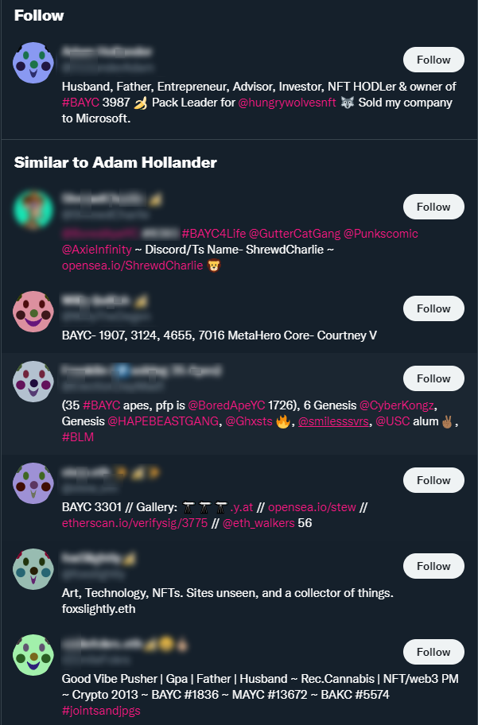

# Bird Site Clown

**Bird Site Clown** is a simple Chrome extension that replaces people's NFT profile picture on the Bird Site with a unique, procedurally generated clown picture.

## Installation

### Chrome Web Store
I might put it up on Chrome Web Store eventually.

### Manual installation

Download the prebuilt release and unzip it into a folder of your choice.

Alternatively clone or download the repo, run `npm install` and then `npm run build`. The extension will be built in folder `extension`.

You can then load the extension by going to
[chrome://extensions](chrome://extensions), enabling "developer mode" (top right
corner) and clicking "Load unpacked" to select the extension folder.

## Why?
Even if we ignore the ecological impact of NFTs, they are rife with numerous scams, stolen artworks, and are generally a really bad idea. They are a silly thing.

## License
The code is licensed under GPL v3. The [source clown image](https://commons.wikimedia.org/wiki/File:Twemoji12_1f921.svg) is licensed under [Creative Commons Attribution 4.0 International](https://creativecommons.org/licenses/by/4.0/deed.en) and the author of the image is Twitter. All derivatives are licensed using the same license.

## Notice
All clowns are randomly generated. Any resemblance or offensive connotation is purely coincidental.

## Changelog
### 0.0.1
* Initial release
